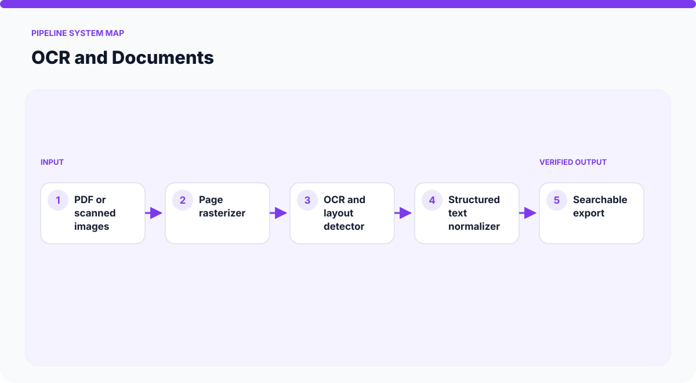
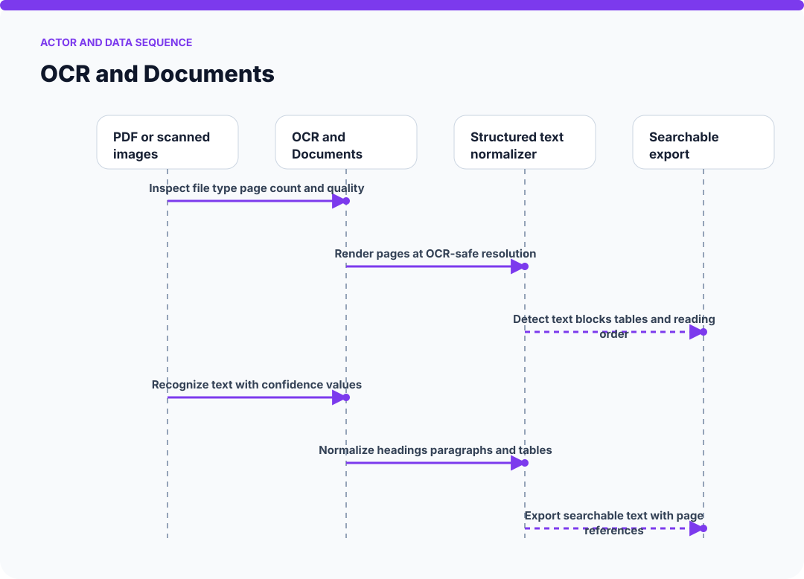
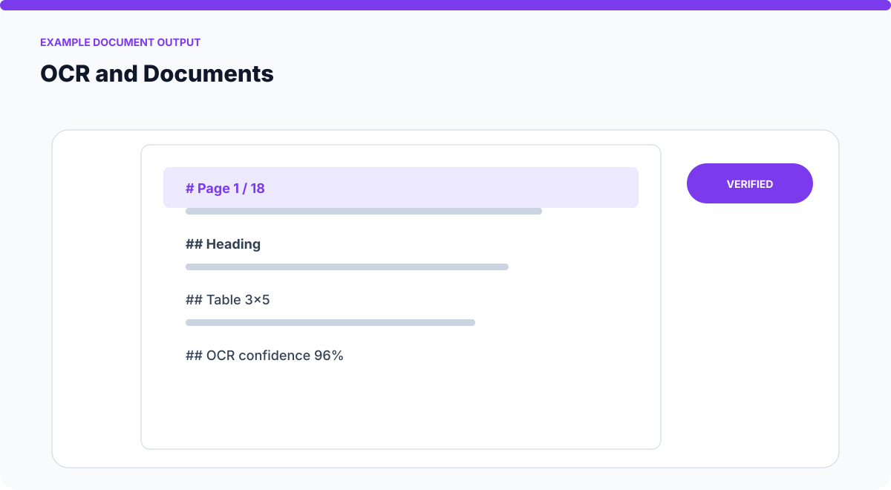
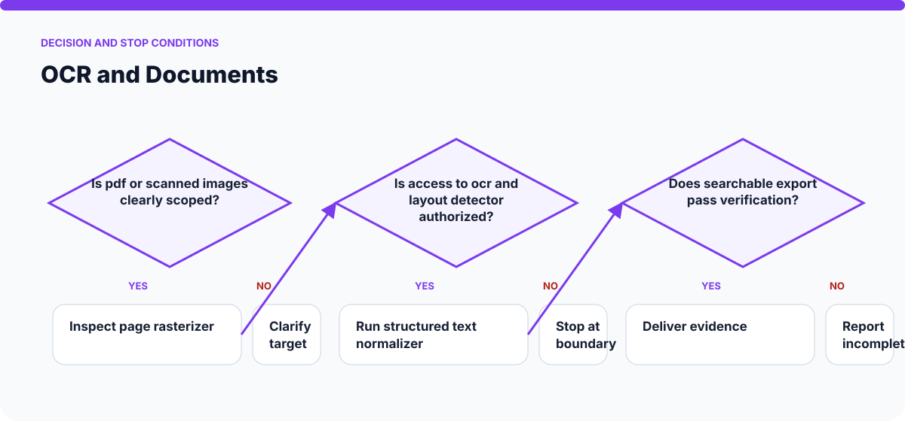

# How OCR and Documents Works

The visuals on this page are static SVGs, so they render directly on GitHub on phones and desktop browsers. Each one is generated from a model specific to this skill.

## System architecture

### Components

- **1. PDF or scanned images:** participates in inspect file type page count and quality.
- **2. Page rasterizer:** participates in render pages at ocr-safe resolution.
- **3. OCR and layout detector:** participates in detect text blocks tables and reading order.
- **4. Structured text normalizer:** participates in recognize text with confidence values.
- **5. Searchable export:** participates in normalize headings paragraphs and tables.

## Actor and data sequence

### 1. Inspect file type page count and quality

**Primary surface:** `PDF or scanned images`

Record the concrete input, the operation performed, and the evidence produced at this stage. Continue only when the output is sufficient for the next stage; otherwise preserve the blocker and stop.
### 2. Render pages at OCR-safe resolution

**Primary surface:** `Page rasterizer`

Record the concrete input, the operation performed, and the evidence produced at this stage. Continue only when the output is sufficient for the next stage; otherwise preserve the blocker and stop.
### 3. Detect text blocks tables and reading order

**Primary surface:** `OCR and layout detector`

Record the concrete input, the operation performed, and the evidence produced at this stage. Continue only when the output is sufficient for the next stage; otherwise preserve the blocker and stop.
### 4. Recognize text with confidence values

**Primary surface:** `Structured text normalizer`

Record the concrete input, the operation performed, and the evidence produced at this stage. Continue only when the output is sufficient for the next stage; otherwise preserve the blocker and stop.
### 5. Normalize headings paragraphs and tables

**Primary surface:** `Searchable export`

Record the concrete input, the operation performed, and the evidence produced at this stage. Continue only when the output is sufficient for the next stage; otherwise preserve the blocker and stop.
### 6. Export searchable text with page references

**Primary surface:** `PDF or scanned images`

Record the concrete input, the operation performed, and the evidence produced at this stage. Continue only when the output is sufficient for the next stage; otherwise preserve the blocker and stop.

## Example output shape

The example is a visual contract: a real run may look different, but it should expose comparable state, provenance, and verification information. It is not presented as evidence of a live external action.

## Decision and stop conditions

The workflow stops when the target is ambiguous, the relevant surface is unavailable or unauthorized, or the final artifact cannot be checked. A logged-in session or successful tool call is not by itself proof that the requested outcome is complete.

## Verification checklist

- Confirm every component shown in the system map exists in the target environment.
- Trace the actor sequence using actual tool output or artifact state.
- Compare the result with the example-output information contract.
- Re-read or reopen the final artifact instead of trusting an attempt message.
- Report omitted stages, unsupported capabilities, and remaining human decisions.
